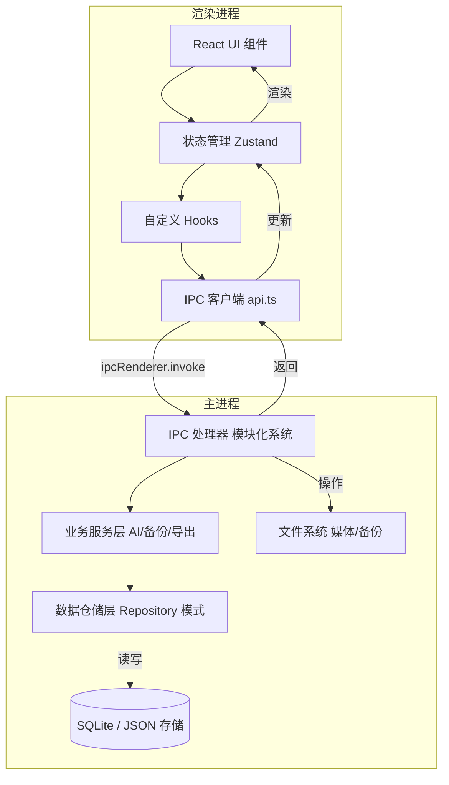
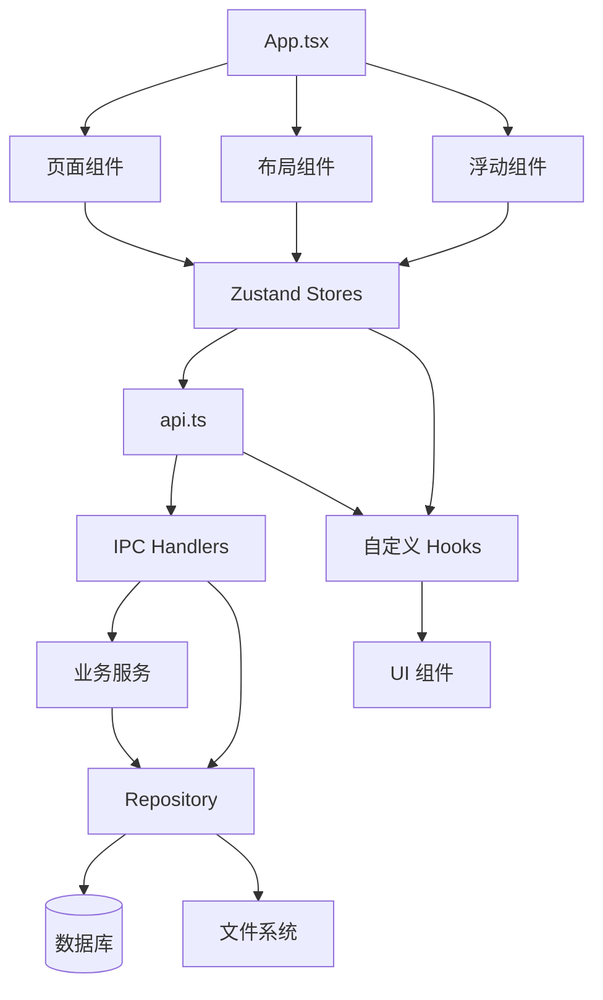

# 脑洞集 (MindVault) 系统架构设计文档

> 系统架构师专用窗口维护 | 创建日期：2026-04-21
> 本文档为技术开发的唯一依据

---

## 目录

1. [项目概述](#1-项目概述)
2. [技术栈详解](#2-技术栈详解)
3. [代码组织结构](#3-代码组织结构)
4. [分层架构设计](#4-分层架构设计)
5. [模块关系与交互](#5-模块关系与交互)
6. [数据库设计](#6-数据库设计)
7. [状态管理设计](#7-状态管理设计)
8. [现有架构优缺点](#8-现有架构优缺点)
9. [后续开发技术建议](#9-后续开发技术建议)

---

## 1. 项目概述

### 1.1 项目简介

**脑洞集 (MindVault)** 是一款创意记录与整理的桌面应用程序，基于 Electron 开发。项目采用现代化的前端技术栈，提供灵活的创意管理功能。

### 1.2 核心功能

- 多类型创意记录（文本、图片、音频、视频、链接）
- 六视图看板系统（画布、看板、图谱、文件夹、大纲、时间线）
- 创意链与知识图谱
- 智能搜索与分类
- 数据导出与备份
- 多主题切换
- 隐私保护

---

## 2. 技术栈详解

### 2.1 核心技术栈

| 类别 | 技术/库 | 版本 | 用途 |
|------|---------|------|------|
| **桌面框架** | Electron | 33.2.1 | 跨平台桌面应用 |
| **前端框架** | React | 18.3.0 | UI 渲染 |
| **路由管理** | React Router DOM | 6.26.0 | 页面导航 |
| **状态管理** | Zustand | 4.5.0 | 全局状态管理 |
| **构建工具** | Vite | 6.0.0 | 开发与构建 |
| **样式方案** | Tailwind CSS | 4.0.0 + CSS 变量 | 响应式样式 |
| **动画库** | Framer Motion | 11.0.0 | 流畅交互动画 |
| **图标库** | Lucide React | 0.400.0 | 统一图标系统 |
| **数据可视化** | ECharts | 5.5.0 | 复杂图表展示 |
| **Markdown** | @uiw/react-md-editor | 4.1.0 | Markdown 编辑器 |
| **Markdown** | react-markdown | 10.1.0 | Markdown 渲染 |
| **Markdown** | remark-gfm | 4.0.1 | GFM 支持 |
| **数据库** | Better-SQLite3 | - | 本地数据存储 |
| **压缩归档** | archiver | 7.0.1 | 备份压缩 |
| **PDF 生成** | pdfkit | 0.18.0 | PDF 导出 |
| **图像处理** | sharp | 0.34.5 | 媒体处理 |
| **类型安全** | TypeScript | 5.6.0 | 类型安全开发 |

### 2.2 开发工具

| 工具 | 用途 |
|------|------|
| concurrently | 并行运行开发服务器 |
| electron-builder | 应用打包 |
| postcss + autoprefixer | CSS 处理 |
| ESLint | 代码 linting |

---

## 3. 代码组织结构

### 3.1 项目目录结构

```
脑洞集/
├── mindvault/                          # 主应用目录
│   ├── src/
│   │   ├── main/                       # Electron 主进程
│   │   │   ├── index.ts                # 主进程入口
│   │   │   ├── preload.js              # 预加载脚本（已编译）
│   │   │   │
│   │   │   ├── db/                     # 数据库层
│   │   │   │   ├── schema.sql          # 数据库表结构
│   │   │   │   ├── migration.ts        # 数据库迁移
│   │   │   │   └── repository.ts       # Repository 仓储模式
│   │   │   │
│   │   │   ├── ipc/                    # 模块化 IPC 处理器
│   │   │   │   ├── index.ts            # IPC 注册入口
│   │   │   │   ├── creativity.ts       # 创意相关 IPC
│   │   │   │   ├── board.ts            # 看板相关 IPC
│   │   │   │   ├── tag.ts              # 标签相关 IPC
│   │   │   │   ├── search.ts           # 搜索相关 IPC
│   │   │   │   ├── settings.ts         # 设置相关 IPC
│   │   │   │   ├── backup.ts           # 备份相关 IPC
│   │   │   │   ├── media.ts            # 媒体相关 IPC
│   │   │   │   ├── template.ts         # 模板相关 IPC
│   │   │   │   └── window.ts           # 窗口控制 IPC
│   │   │   │
│   │   │   ├── services/               # 业务服务层
│   │   │   │   ├── ai-recommend.ts     # AI 推荐服务
│   │   │   │   ├── backup.ts           # 备份服务
│   │   │   │   └── export.ts           # 导出服务
│   │   │   │
│   │   │   └── utils/                  # 工具函数
│   │   │
│   │   ├── renderer/                   # 渲染进程（前端）
│   │   │   ├── App.tsx                 # 根组件
│   │   │   ├── main.tsx                # React 入口
│   │   │   │
│   │   │   ├── pages/                  # 页面组件
│   │   │   │   ├── Home.tsx            # 首页
│   │   │   │   ├── Board.tsx           # 看板页
│   │   │   │   ├── Search.tsx          # 搜索页
│   │   │   │   ├── Favorites.tsx       # 收藏页
│   │   │   │   ├── Trash.tsx           # 回收站
│   │   │   │   ├── Templates.tsx       # 模板页
│   │   │   │   ├── Stats.tsx           # 统计页
│   │   │   │   ├── Settings.tsx        # 设置页
│   │   │   │   └── Export.tsx          # 导出页
│   │   │   │
│   │   │   ├── components/             # 通用组件
│   │   │   │   ├── board/              # 看板六视图
│   │   │   │   │   ├── CanvasView.tsx  # 画布 - 自由创作
│   │   │   │   │   ├── BoardView.tsx   # 看板 - 便利贴墙
│   │   │   │   │   ├── GraphView.tsx   # 图谱 - 思维导图
│   │   │   │   │   ├── FolderView.tsx  # 文件夹 - 分类管理
│   │   │   │   │   ├── OutlineView.tsx # 大纲 - 树形结构
│   │   │   │   │   └── TimelineView.tsx# 时间线 - 时间轴展示
│   │   │   │   ├── card/               # 卡片组件
│   │   │   │   │   ├── CardItem.tsx    # 卡片列表项
│   │   │   │   │   ├── CardEditor.tsx  # 卡片编辑器
│   │   │   │   │   ├── CardPreview.tsx # 卡片预览
│   │   │   │   │   ├── StickyCard.tsx  # 便签卡片
│   │   │   │   │   └── CardStyles.tsx  # 卡片样式
│   │   │   │   ├── layout/             # 布局组件
│   │   │   │   │   ├── Header.tsx      # 顶部导航
│   │   │   │   │   ├── Sidebar.tsx     # 侧边栏
│   │   │   │   │   └── MainContent.tsx # 主内容区
│   │   │   │   ├── common/             # 通用组件
│   │   │   │   │   ├── ThemeSwitcher.tsx   # 主题切换器
│   │   │   │   │   ├── AnimatedButton.tsx  # 动画按钮
│   │   │   │   │   └── ConfirmDialog.tsx   # 确认对话框
│   │   │   │   ├── dashboard/          # 仪表板组件
│   │   │   │   │   └── StatsDashboard.tsx  # 统计仪表板
│   │   │   │   ├── quick-capture/      # 快速录入组件
│   │   │   │   │   ├── QuickCapture.tsx    # 快速录入弹窗
│   │   │   │   │   └── DropZone.tsx        # 拖放区域
│   │   │   │   ├── FloatingEditorManager.tsx # 浮动编辑器
│   │   │   │   ├── SearchDialog.tsx    # 搜索对话框
│   │   │   │   ├── ShortcutGuide.tsx   # 快捷键指南
│   │   │   │   ├── AboutDialog.tsx     # 关于对话框
│   │   │   │   └── PrivacyLock.tsx     # 隐私锁
│   │   │   │
│   │   │   ├── stores/                 # Zustand 状态管理
│   │   │   │   ├── creativityStore.ts  # 创意状态
│   │   │   │   ├── boardStore.ts       # 看板状态
│   │   │   │   ├── uiStore.ts          # UI 状态
│   │   │   │   └── settingsStore.ts    # 设置状态
│   │   │   │
│   │   │   ├── hooks/                  # 自定义 Hooks
│   │   │   │   ├── useAudioRecorder.ts # 音频录制
│   │   │   │   ├── useAutoSave.ts      # 自动保存
│   │   │   │   ├── useKeyboardShortcuts.ts # 快捷键管理
│   │   │   │   ├── useMarkdownWordCount.ts # 字数统计
│   │   │   │   ├── useSearch.ts        # 搜索逻辑
│   │   │   │   └── useTheme.ts         # 主题切换
│   │   │   │
│   │   │   ├── styles/                 # 样式文件
│   │   │   │   ├── globals.css         # 全局样式
│   │   │   │   ├── themes/             # 主题文件
│   │   │   │   │   ├── light.css       # 经典白
│   │   │   │   │   ├── dark.css        # 经典黑
│   │   │   │   │   ├── morandi-warm.css # 暖调莫兰迪
│   │   │   │   │   ├── morandi-cool.css  # 冷调莫兰迪
│   │   │   │   │   └── morandi-nature.css # 自然莫兰迪
│   │   │   │   └── components/         # 组件样式
│   │   │   │       ├── animations.css  # 动画效果
│   │   │   │       ├── custom-cursor.css # 自定义光标
│   │   │   │       └── sticky-card.css # 便签卡片
│   │   │   │
│   │   │   ├── public/                 # 静态资源
│   │   │   │   └── cursors/            # 自定义光标（20+ 种）
│   │   │   │
│   │   │   ├── utils/                  # 工具函数
│   │   │   │   ├── api.ts              # IPC API 封装
│   │   │   │   ├── exporters.ts        # 导出工具
│   │   │   │   ├── formatters.ts       # 格式化工具
│   │   │   │   ├── sound.ts            # 音效播放
│   │   │   │   └── validators.ts       # 验证工具
│   │   │   │
│   │   │   └── types/                  # 类型定义
│   │   │       ├── board.ts            # 看板类型
│   │   │       ├── creativity.ts       # 创意类型
│   │   │       └── settings.ts         # 设置类型
│   │   │
│   │   └── shared/                     # 共享代码
│   │       ├── types.ts                # 共享类型定义
│   │       ├── constants.ts            # 常量定义
│   │       └── ipc-channels.ts         # IPC 通道常量
│   │
│   ├── dist/                           # 编译输出
│   │   └── main/                      # 主进程编译文件
│   │
│   ├── package.json                    # 项目配置
│   ├── tsconfig.json                   # TypeScript 配置
│   ├── tsconfig.main.json             # 主进程 TypeScript 配置
│   ├── vite.config.ts                 # Vite 配置
│   ├── postcss.config.js              # PostCSS 配置
│   ├── build.ps1                      # Windows 构建脚本
│   └── build-windows.bat              # Windows 批处理构建
│
├── docs/                              # 项目文档
│   ├── architecture.md                # 架构文档
│   ├── api.md                         # API 文档
│   ├── frontend.md                    # 前端文档
│   └── requirements.md                # 需求文档
│
├── design/                            # 设计资源
│   ├── screenshots/                   # 截图
│   ├── home-redesign.md               # 首页重设计
│   └── ui-review.md                   # UI 评审
│
├── test/                              # 测试目录
│   ├── bug-list.md                    # Bug 列表
│   └── README.md
│
├── .trae/                             # Trae IDE 配置
│   └── documents/
│       ├── 创意库板块重构计划.md
│       └── 创意库板块重构_tasks.md
│
└── README.md                          # 项目说明
```

### 3.2 编译输出结构

项目包含完整的 TypeScript 源代码和已编译的 JavaScript 输出：
- `src/main/` - TypeScript 源文件
- `dist/main/` - 编译后的 JavaScript 文件
- `.d.ts` - 类型声明文件

---

## 4. 分层架构设计

### 4.1 整体架构图



### 4.2 渲染进程架构

#### 4.2.1 UI 层（UI Layer）

**职责**：负责用户界面展示和交互
**核心组件**：
- `App.tsx` - 根组件，路由管理
- 页面组件（Pages）
- 通用组件（Components）
- 六视图看板组件

#### 4.2.2 状态层（State Layer）

**职责**：管理全局应用状态
**核心 Store**：
- `creativityStore.ts` - 创意管理状态
- `boardStore.ts` - 看板管理状态
- `settingsStore.ts` - 设置状态
- `uiStore.ts` - UI 交互状态

**Store 设计特点**：
- 基于 Zustand 轻量级状态管理
- 每个 Store 独立管理对应领域
- 通过 API 层与主进程通信
- 支持选择器优化（selector）

#### 4.2.3 自定义 Hooks 层

**职责**：封装可复用的业务逻辑
**核心 Hooks**：
- `useAudioRecorder` - 音频录制与播放
- `useAutoSave` - 编辑器自动保存
- `useKeyboardShortcuts` - 全局快捷键管理
- `useMarkdownWordCount` - 字数统计与阅读时间
- `useSearch` - 搜索逻辑封装
- `useTheme` - 主题切换管理

#### 4.2.4 通信层（API Layer）

**职责**：封装 IPC 通信，提供友好的 API 接口
**文件**：`src/renderer/utils/api.ts`

**核心特性**：
- 兼容 Electron 环境和浏览器预览环境
- 浏览器环境下提供 Mock 数据
- 统一的错误处理
- 类型安全的 API 调用

### 4.3 主进程架构

#### 4.3.1 IPC 处理器层

**职责**：处理来自渲染进程的 IPC 调用
**模块组织**：
```
ipc/
├── index.ts          # IPC 注册入口
├── creativity.ts     # 创意相关
├── board.ts          # 看板相关
├── tag.ts            # 标签相关
├── search.ts         # 搜索相关
├── settings.ts       # 设置相关
├── backup.ts         # 备份相关
├── media.ts          # 媒体相关
├── template.ts       # 模板相关
└── window.ts         # 窗口控制
```

**设计原则**：
- 每个模块独立管理，职责清晰
- 易于扩展和维护
- 支持按模块加载和卸载
- 完整的类型定义

**IPC 通道命名规范**：`module:action`
- `creativity:create`
- `board:canvas-list-items`
- `search:fulltext`

#### 4.3.2 业务服务层

**职责**：封装复杂的业务逻辑
**核心服务**：

| 服务 | 功能 | 文件 |
|------|------|------|
| AIRecommendService | 智能推荐创意 | ai-recommend.ts |
| BackupService | 数据备份与恢复 | backup.ts |
| ExportService | 多格式数据导出 | export.ts |

#### 4.3.3 数据仓储层

**职责**：提供统一的数据访问接口
**文件**：`src/main/db/repository.ts`

**核心功能**：
- Repository 设计模式
- 支持双存储引擎（SQLite / JSON）
- 字段自动转换（snake_case ↔ camelCase）
- 统一的工具函数

**存储降级策略**：
1. 优先使用 Better-SQLite3
2. 如果失败，降级到 JSON 文件存储
3. 两种模式通过相同的 API 访问

#### 4.3.4 数据库层

**职责**：数据持久化存储
**核心组件**：
- SQLite 数据库（primary）
- JSON 文件存储（fallback）
- 文件系统（媒体/备份）

**迁移系统**：
- 版本化数据库结构
- 自动升级机制
- 数据验证和回滚

### 4.4 共享层

**职责**：提供前后端共享的类型和常量
**核心文件**：
- `src/shared/types.ts` - 共享类型定义
- `src/shared/constants.ts` - 常量定义
- `src/shared/ipc-channels.ts` - IPC 通道常量

---

## 5. 模块关系与交互

### 5.1 核心模块依赖图



### 5.2 数据流向

#### 5.2.1 读取数据流程

```
用户交互
    ↓
UI 组件
    ↓
Store fetch 方法
    ↓
api.ts (IPC invoke)
    ↓
IPC Handler
    ↓
Repository
    ↓
SQLite / JSON
    ↓
返回数据
    ↓
更新 Store
    ↓
重新渲染 UI
```

#### 5.2.2 写入数据流程

```
用户操作
    ↓
UI 组件回调
    ↓
Store action
    ↓
api.ts (IPC invoke)
    ↓
IPC Handler
    ↓
[可选] 业务服务处理
    ↓
Repository
    ↓
SQLite / JSON
    ↓
返回结果
    ↓
更新 Store
    ↓
UI 反馈
```

### 5.3 看板六视图交互

**视图切换机制**：
- 每个看板有独立的视图模式
- 通过 `boardStore.ts` 管理当前视图
- 视图切换时重新加载对应数据

**共享数据**：
- 所有视图共享同一批创意数据
- 画布位置、图谱结构等独立存储
- 支持多视图间的数据同步

---

## 6. 数据库设计

### 6.1 核心表结构

#### 6.1.1 创意表（creativities）

```sql
CREATE TABLE creativities (
    id                TEXT PRIMARY KEY,
    title             TEXT NOT NULL,
    content           TEXT DEFAULT '',
    type              TEXT DEFAULT 'text' NOT NULL,
    subtype           TEXT,
    content_format    TEXT DEFAULT 'plain',
    word_count        INTEGER DEFAULT 0,
    priority          INTEGER DEFAULT 0,
    emoji_reaction    TEXT,
    status            TEXT DEFAULT 'active' NOT NULL,
    template_id       TEXT,
    board_id          TEXT,
    position_x        REAL,
    position_y        REAL,
    card_style        TEXT,
    is_read           INTEGER DEFAULT 1,
    is_favorite       INTEGER DEFAULT 0,
    created_at        TEXT NOT NULL,
    updated_at        TEXT NOT NULL,
    last_reviewed_at  TEXT
);
```

**字段说明**：
- `type` - 创意类型（text/image/audio/video/link）
- `subtype` - 写作子类型（idea/outline/character/scene/dialogue/chapter/worldbuilding/plot）
- `status` - 状态（active/archived/trashed）
- `priority` - 优先级（0-5）

#### 6.1.2 标签表（tags）

```sql
CREATE TABLE tags (
    id          TEXT PRIMARY KEY,
    name        TEXT NOT NULL UNIQUE,
    color       TEXT DEFAULT '#6366f1',
    icon        TEXT,
    created_at  TEXT NOT NULL
);
```

#### 6.1.3 创意-标签关联表（creativity_tags）

```sql
CREATE TABLE creativity_tags (
    creativity_id   TEXT NOT NULL,
    tag_id          TEXT NOT NULL,
    PRIMARY KEY (creativity_id, tag_id),
    FOREIGN KEY (creativity_id) REFERENCES creativities(id) ON DELETE CASCADE,
    FOREIGN KEY (tag_id) REFERENCES tags(id) ON DELETE CASCADE
);
```

#### 6.1.4 看板表（boards）

```sql
CREATE TABLE boards (
    id          TEXT PRIMARY KEY,
    name        TEXT NOT NULL,
    description TEXT DEFAULT '',
    background  TEXT,
    theme       TEXT,
    layout      TEXT DEFAULT 'board' NOT NULL,
    sort_order  INTEGER DEFAULT 0,
    created_at  TEXT NOT NULL,
    updated_at  TEXT NOT NULL
);
```

#### 6.1.5 看板-创意关联表（board_creativities）

```sql
CREATE TABLE board_creativities (
    board_id         TEXT NOT NULL,
    creativity_id    TEXT NOT NULL,
    PRIMARY KEY (board_id, creativity_id),
    FOREIGN KEY (board_id) REFERENCES boards(id) ON DELETE CASCADE,
    FOREIGN KEY (creativity_id) REFERENCES creativities(id) ON DELETE CASCADE
);
```

### 6.2 看板扩展表

#### 6.2.1 画布项表（board_canvas_items）

```sql
CREATE TABLE board_canvas_items (
    id              TEXT PRIMARY KEY,
    board_id        TEXT NOT NULL,
    creativity_id   TEXT NOT NULL,
    position_x      REAL DEFAULT 0,
    position_y      REAL DEFAULT 0,
    width           REAL,
    height          REAL,
    created_at      TEXT NOT NULL,
    FOREIGN KEY (board_id) REFERENCES boards(id) ON DELETE CASCADE,
    FOREIGN KEY (creativity_id) REFERENCES creativities(id) ON DELETE CASCADE
);
```

#### 6.2.2 画布连线表（board_canvas_edges）

```sql
CREATE TABLE board_canvas_edges (
    id              TEXT PRIMARY KEY,
    board_id        TEXT NOT NULL,
    source_item_id  TEXT NOT NULL,
    target_item_id  TEXT NOT NULL,
    edge_type       TEXT DEFAULT 'related',
    label           TEXT,
    created_at      TEXT NOT NULL,
    FOREIGN KEY (board_id) REFERENCES boards(id) ON DELETE CASCADE
);
```

#### 6.2.3 便签表（board_sticky_notes）

```sql
CREATE TABLE board_sticky_notes (
    id                    TEXT PRIMARY KEY,
    board_id              TEXT NOT NULL,
    title                 TEXT DEFAULT '',
    content               TEXT DEFAULT '',
    color                 TEXT DEFAULT '#fff9c4',
    position_x            REAL DEFAULT 0,
    position_y            REAL DEFAULT 0,
    source_creativity_ids TEXT,
    sort_order            INTEGER DEFAULT 0,
    created_at            TEXT NOT NULL,
    updated_at            TEXT NOT NULL,
    FOREIGN KEY (board_id) REFERENCES boards(id) ON DELETE CASCADE
);
```

#### 6.2.4 图谱节点表（board_graph_nodes）

```sql
CREATE TABLE board_graph_nodes (
    id              TEXT PRIMARY KEY,
    board_id        TEXT NOT NULL,
    creativity_id   TEXT,
    parent_id       TEXT,
    position_x      REAL,
    position_y      REAL,
    node_type       TEXT DEFAULT 'creativity',
    label           TEXT,
    created_at      TEXT NOT NULL,
    FOREIGN KEY (board_id) REFERENCES boards(id) ON DELETE CASCADE,
    FOREIGN KEY (parent_id) REFERENCES board_graph_nodes(id) ON DELETE SET NULL
);
```

#### 6.2.5 图谱连线表（board_graph_edges）

```sql
CREATE TABLE board_graph_edges (
    id              TEXT PRIMARY KEY,
    board_id        TEXT NOT NULL,
    source_node_id  TEXT NOT NULL,
    target_node_id  TEXT NOT NULL,
    edge_type       TEXT DEFAULT 'child',
    created_at      TEXT NOT NULL,
    FOREIGN KEY (board_id) REFERENCES boards(id) ON DELETE CASCADE
);
```

#### 6.2.6 自定义文件夹表（board_custom_folders）

```sql
CREATE TABLE board_custom_folders (
    id          TEXT PRIMARY KEY,
    board_id    TEXT NOT NULL,
    name        TEXT NOT NULL,
    color       TEXT DEFAULT '#6366f1',
    icon        TEXT,
    sort_order  INTEGER DEFAULT 0,
    created_at  TEXT NOT NULL,
    FOREIGN KEY (board_id) REFERENCES boards(id) ON DELETE CASCADE
);
```

#### 6.2.7 文件夹-创意关联表（board_folder_items）

```sql
CREATE TABLE board_folder_items (
    folder_id      TEXT NOT NULL,
    creativity_id  TEXT NOT NULL,
    PRIMARY KEY (folder_id, creativity_id),
    FOREIGN KEY (folder_id) REFERENCES board_custom_folders(id) ON DELETE CASCADE,
    FOREIGN KEY (creativity_id) REFERENCES creativities(id) ON DELETE CASCADE
);
```

### 6.3 其他核心表

#### 6.3.1 模板表（templates）

```sql
CREATE TABLE templates (
    id          TEXT PRIMARY KEY,
    name        TEXT NOT NULL,
    description TEXT DEFAULT '',
    category    TEXT,
    config      TEXT DEFAULT '{}',
    is_builtin  INTEGER DEFAULT 0,
    created_at  TEXT NOT NULL
);
```

#### 6.3.2 设置表（settings）

```sql
CREATE TABLE settings (
    key         TEXT PRIMARY KEY,
    value       TEXT NOT NULL
);
```

#### 6.3.3 创意关联表（creativity_links）

```sql
CREATE TABLE creativity_links (
    id             TEXT PRIMARY KEY,
    source_id      TEXT NOT NULL,
    target_id      TEXT NOT NULL,
    relation_type  TEXT DEFAULT 'related' NOT NULL,
    created_at     TEXT NOT NULL,
    FOREIGN KEY (source_id) REFERENCES creativities(id) ON DELETE CASCADE,
    FOREIGN KEY (target_id) REFERENCES creativities(id) ON DELETE CASCADE
);
```

#### 6.3.4 媒体文件表（media）

```sql
CREATE TABLE media (
    id              TEXT PRIMARY KEY,
    creativity_id   TEXT,
    filename        TEXT NOT NULL,
    filepath        TEXT NOT NULL,
    mime_type       TEXT NOT NULL,
    file_size       INTEGER NOT NULL,
    width           INTEGER,
    height          INTEGER,
    thumbnail_path  TEXT,
    sort_order      INTEGER DEFAULT 0,
    created_at      TEXT NOT NULL,
    FOREIGN KEY (creativity_id) REFERENCES creativities(id) ON DELETE SET NULL
);
```

### 6.4 索引设计

**性能优化索引**：

```sql
-- 创意表索引
CREATE INDEX idx_creativities_type ON creativities(type);
CREATE INDEX idx_creativities_status ON creativities(status);
CREATE INDEX idx_creativities_priority ON creativities(priority);
CREATE INDEX idx_creativities_created_at ON creativities(created_at);
CREATE INDEX idx_creativities_updated_at ON creativities(updated_at);
CREATE INDEX idx_creativities_board_id ON creativities(board_id);
CREATE INDEX idx_creativities_template_id ON creativities(template_id);
CREATE INDEX idx_creativities_is_read ON creativities(is_read);

-- 标签索引
CREATE INDEX idx_tags_name ON tags(name);

-- 关联表索引
CREATE INDEX idx_creativity_tags_tag_id ON creativity_tags(tag_id);
CREATE INDEX idx_creativity_tags_creativity_id ON creativity_tags(creativity_id);
CREATE INDEX idx_creativity_links_source_id ON creativity_links(source_id);
CREATE INDEX idx_creativity_links_target_id ON creativity_links(target_id);
CREATE INDEX idx_creativity_links_relation_type ON creativity_links(relation_type);

-- 看板索引
CREATE INDEX idx_boards_sort_order ON boards(sort_order);
CREATE INDEX idx_boards_layout ON boards(layout);

-- 看板-创意关联索引
CREATE INDEX idx_board_creativities_board_id ON board_creativities(board_id);
CREATE INDEX idx_board_creativities_creativity_id ON board_creativities(creativity_id);

-- 画布相关索引
CREATE INDEX idx_board_canvas_items_board_id ON board_canvas_items(board_id);
CREATE INDEX idx_board_canvas_items_creativity_id ON board_canvas_items(creativity_id);
CREATE INDEX idx_board_canvas_edges_board_id ON board_canvas_edges(board_id);
CREATE INDEX idx_board_canvas_edges_source_item_id ON board_canvas_edges(source_item_id);
CREATE INDEX idx_board_canvas_edges_target_item_id ON board_canvas_edges(target_item_id);

-- 便签索引
CREATE INDEX idx_board_sticky_notes_board_id ON board_sticky_notes(board_id);
CREATE INDEX idx_board_sticky_notes_sort_order ON board_sticky_notes(sort_order);

-- 图谱索引
CREATE INDEX idx_board_graph_nodes_board_id ON board_graph_nodes(board_id);
CREATE INDEX idx_board_graph_nodes_creativity_id ON board_graph_nodes(creativity_id);
CREATE INDEX idx_board_graph_nodes_parent_id ON board_graph_nodes(parent_id);
CREATE INDEX idx_board_graph_edges_board_id ON board_graph_edges(board_id);
CREATE INDEX idx_board_graph_edges_source_node_id ON board_graph_edges(source_node_id);
CREATE INDEX idx_board_graph_edges_target_node_id ON board_graph_edges(target_node_id);

-- 文件夹索引
CREATE INDEX idx_board_custom_folders_board_id ON board_custom_folders(board_id);
CREATE INDEX idx_board_custom_folders_sort_order ON board_custom_folders(sort_order);
CREATE INDEX idx_board_folder_items_folder_id ON board_folder_items(folder_id);
CREATE INDEX idx_board_folder_items_creativity_id ON board_folder_items(creativity_id);

-- 媒体索引
CREATE INDEX idx_media_creativity_id ON media(creativity_id);
CREATE INDEX idx_media_sort_order ON media(sort_order);

-- 模板索引
CREATE INDEX idx_templates_category ON templates(category);
CREATE INDEX idx_templates_is_builtin ON templates(is_builtin);
```

### 6.5 默认数据

**内置模板**（7 个）：
- 空白创意
- 产品灵感
- 写作素材
- 旅行计划
- 学习笔记
- 效率工具
- 阅读笔记

**写作模板**（新增）：
- 章节大纲
- 人物设定
- 世界观设定
- 场景描述
- 对话模板
- 分场大纲

**默认设置**：
- 主题：light
- 语言：zh-CN
- 字体：PingFang SC, Microsoft YaHei
- 自动备份：true
- 备份间隔：30分钟
- 隐私锁：false

---

## 7. 状态管理设计

### 7.1 Zustand Store 结构

#### 7.1.1 creativityStore.ts

**状态**：
- `creativities` - 创意列表
- `currentCreativity` - 当前查看的创意
- `stats` - 统计数据
- `isLoading` - 加载状态
- `isSaving` - 保存状态
- `pagination` - 分页信息

**方法**：
- `fetchCreativities(params)` - 获取创意列表
- `fetchCreativity(id)` - 获取单个创意详情
- `createCreativity(input)` - 创建新创意
- `updateCreativity(id, data)` - 更新创意
- `deleteCreativity(id)` - 删除创意（移至回收站）
- `searchCreativities(keyword)` - 搜索创意
- `getRandomCreativity()` - 随机创意
- `toggleFavorite(id)` - 切换收藏
- `fetchStats()` - 获取统计信息
- `setCurrentCreativity(c)` - 设置当前创意
- `clearCurrentCreativity()` - 清除当前创意

#### 7.1.2 boardStore.ts

**状态**：
- `boards` - 看板列表
- `currentBoard` - 当前看板
- `isLoading` - 加载状态

- `canvasItems` - 画布项
- `canvasEdges` - 画布连线
- `selectedCanvasItemIds` - 选中的画布项
- `isCanvasConnecting` - 连线模式
- `connectingFromItemId` - 连线源项
- `canvasToolMode` - 画布工具模式

- `stickyNotes` - 便签列表
- `graphNodes` - 图谱节点
- `graphEdges` - 图谱连线
- `customFolders` - 自定义文件夹
- `creativeChains` - 创意链

- `viewMode` - 当前视图模式

**核心方法（画布）**：
- `fetchCanvasData(boardId)` - 获取画布数据
- `addCanvasItem(boardId, creativityId, x, y)` - 添加画布项
- `removeCanvasItem(itemId)` - 移除画布项
- `updateCanvasItemPosition(itemId, x, y)` - 更新位置
- `addCanvasEdge(boardId, sourceId, targetId, edgeType)` - 添加连线
- `removeCanvasEdge(edgeId)` - 移除连线
- `updateCanvasEdgeConnector(edgeId, isSource, connector)` - 更新连接点
- `updateCanvasEdgeLabel(edgeId, label)` - 更新连线标签
- `toggleCanvasItemSelection(itemId)` - 切换选中
- `clearCanvasSelection()` - 清除选择
- `setCanvasConnecting(connecting, fromItemId)` - 设置连线模式
- `setCanvasToolMode(mode)` - 设置工具模式

**核心方法（看板）**：
- `fetchBoards()` - 获取看板列表
- `fetchBoard(id)` - 获取看板详情
- `createBoard(data)` - 创建看板
- `updateBoard(id, data)` - 更新看板
- `deleteBoard(id)` - 删除看板
- `setCurrentBoard(b)` - 设置当前看板
- `setViewMode(mode)` - 切换视图

**核心方法（便签）**：
- `fetchStickyNotes(boardId)` - 获取便签
- `addStickyNote(boardId, data)` - 添加便签
- `updateStickyNote(noteId, data)` - 更新便签
- `removeStickyNote(noteId)` - 移除便签
- `sendToBoard(noteId)` - 发送到看板

**核心方法（图谱）**：
- `fetchGraphData(boardId)` - 获取图谱数据
- `addGraphNode(boardId, data)` - 添加节点
- `updateGraphNodePosition(nodeId, x, y)` - 更新位置
- `removeGraphNode(nodeId)` - 移除节点
- `addGraphEdge(boardId, sourceId, targetId, edgeType)` - 添加边
- `removeGraphEdge(edgeId)` - 移除边
- `getSubtree(nodeId)` - 获取子树
- `sendSubtreeToCanvas(nodeId)` - 发送子树到画布

**核心方法（文件夹）**：
- `fetchCustomFolders(boardId)` - 获取文件夹
- `createFolder(boardId, name, color)` - 创建文件夹
- `updateFolder(folderId, data)` - 更新文件夹
- `deleteFolder(folderId)` - 删除文件夹
- `addToFolder(folderId, creativityIds)` - 添加到文件夹
- `removeFromFolder(folderId, creativityIds)` - 从文件夹移除
- `applyFolderToBoard(folderId)` - 应用文件夹到看板

**核心方法（创意链）**：
- `fetchCreativeChains(boardId)` - 获取创意链
- `createCreativeChain(boardId, data)` - 创建创意链
- `updateCreativeChain(boardId, chainId, data)` - 更新创意链
- `deleteCreativeChain(boardId, chainId)` - 删除创意链
- `createChainAndSticky(boardId, data, stickyData)` - 创建链和便签

#### 7.1.3 settingsStore.ts

**状态**：
- `settings` - 设置对象
- `isLoaded` - 是否加载完成

**方法**：
- `loadSettings()` - 加载设置
- `saveSettings(newSettings)` - 保存设置
- `updateSetting(key, value)` - 更新单个设置
- `resetSettings()` - 重置默认设置

#### 7.1.4 uiStore.ts

**状态**：
- `sidebarOpen` - 侧边栏是否展开
- `quickCaptureOpen` - 快速录入是否打开
- `aboutDialogOpen` - 关于对话框是否打开
- `shortcutGuideOpen` - 快捷键指南是否打开
- `searchDialogOpen` - 搜索对话框是否打开
- `toasts` - Toast 消息列表
- `pendingFiles` - 待处理文件

**方法**：
- `toggleSidebar()` - 切换侧边栏
- `setQuickCaptureOpen(open)` - 设置快速录入
- `setAboutDialogOpen(open)` - 设置关于对话框
- `setShortcutGuideOpen(open)` - 设置快捷键指南
- `setSearchDialogOpen(open)` - 设置搜索对话框
- `showToast(message, type)` - 显示 Toast
- `hideToast(id)` - 隐藏 Toast
- `setPendingFiles(files)` - 设置待处理文件
- `clearPendingFiles()` - 清除待处理文件

### 7.2 Store 设计原则

1. **单一职责** - 每个 Store 管理特定领域
2. **类型安全** - 完整的 TypeScript 类型定义
3. **可测试性** - 纯函数，易于单元测试
4. **性能优化** - 支持选择器（selector）避免不必要渲染
5. **持久化** - 通过 IPC 与主进程同步

---

## 8. 现有架构优缺点

### 8.1 架构优点

#### 8.1.1 分层清晰

- **渲染进程**：UI → State → Hooks → API
- **主进程**：IPC → Services → Repository → DB
- 职责明确，易于理解和维护

#### 8.1.2 模块化设计

- IPC 处理器按功能模块化
- 支持按模块独立开发和测试
- 易于扩展新功能

#### 8.1.3 双存储引擎

- 优先使用 SQLite，性能更好
- 降级到 JSON 保证兼容性
- 统一的 API 访问

#### 8.1.4 类型安全

- 完整的 TypeScript 类型定义
- 前后端共享类型
- 类型转换自动化

#### 8.1.5 现代前端技术栈

- React 18 + Zustand 轻量级状态管理
- Framer Motion 流畅动画
- Tailwind CSS 响应式样式
- Vite 快速构建

#### 8.1.6 功能完整性

- 六视图看板系统
- 创意链和知识图谱
- 多主题支持（5 套内置）
- 自定义光标（20+ 种）
- 备份导出功能

#### 8.1.7 开发体验良好

- Web 开发模式，快速迭代
- 完整的 Mock 数据支持
- 类型提示完善

### 8.2 架构缺点与改进点

#### 8.2.1 技术债务

| 债务项 | 描述 | 影响 | 优先级 |
|--------|------|------|--------|
| **TypeScript 源文件缺失** | src/main/ 目录下缺少部分 TypeScript 源文件，依赖 dist/ 中的编译文件 | 无法修改源码，维护困难 | 🔴 高 |
| **双套文件并存** | .ts 和编译后的 .js/.d.ts 同时存在 | 混淆源文件，可能导致不一致 | 🔴 高 |
| **字段命名不一致** | 数据库 snake_case vs 前端 camelCase | 数据转换复杂，容易出错 | 🟠 中 |
| **预加载脚本已编译** | preload.js 是编译后的文件 | 无法查看和修改源代码 | 🔴 高 |
| **测试覆盖不足** | 缺少单元测试和集成测试 | 重构风险高，质量难以保证 | 🟠 中 |
| **文档不完整** | API 文档和开发文档不完善 | 新人上手困难 | 🟠 中 |
| **性能监控缺失** | 缺少性能监控和分析工具 | 难以发现和定位性能瓶颈 | 🟡 低 |

#### 8.2.2 代码组织问题

1. **组件过大**：`CanvasView.tsx` 等组件过于庞大（>1000 行）
   - 建议拆分为更小的子组件

2. **状态耦合**：部分组件直接依赖多个 Store
   - 建议使用自定义 Hooks 封装状态逻辑

3. **样式混合**：内联样式和 CSS 变量混用
   - 建议统一到 CSS 变量或 Tailwind 类

#### 8.2.3 功能实现问题

1. **部分 IPC Handler 可能不完整**
   - 需要验证所有暴露的 API 是否有对应实现

2. **Repository 模式实现较简单**
   - 缺少真正的 ORM 层
   - SQL 查询直接拼接，存在安全风险

3. **事务处理不完善**
   - 批量操作缺少事务保护
   - 可能导致数据不一致

#### 8.2.4 性能问题

1. **缺少虚拟滚动**
   - 大量创意列表可能导致性能问题
   - 建议实现虚拟列表

2. **状态更新过频繁**
   - 画布拖拽时频繁调用 IPC
   - 建议实现防抖和批量更新

3. **缺少缓存机制**
   - 标签列表、统计数据等每次重新加载
   - 建议增加本地缓存

---

## 9. 后续开发技术建议

### 9.1 短期改进（1-3 个月）

#### 9.1.1 代码质量

**优先级：🔴 高**

1. **完善 TypeScript 源文件**
   - 补全 `src/main/` 下缺失的 .ts 源文件
   - 移除或忽略编译后的 .js 文件
   - 确保所有代码从 TypeScript 编译

2. **添加测试覆盖**
   - 单元测试：Jest + Testing Library
   - 集成测试：Playwright
   - 目标覆盖：核心业务逻辑 >80%

3. **完善文档**
   - API 文档自动生成
   - 组件文档（Storybook）
   - 开发指南和贡献流程

#### 9.1.2 架构优化

**优先级：🔴 高**

1. **实现完整的 Repository 模式**
   - 为每个表创建独立的 Repository 类
   - 使用查询构建器，避免 SQL 注入
   - 实现事务支持

2. **重构大组件**
   - `CanvasView.tsx` 拆分为子组件
   - 提取画布工具条、右键菜单等独立组件
   - 使用自定义 Hooks 封装拖拽逻辑

3. **实现字段自动转换**
   - 统一数据库字段命名规范
   - Repository 层自动处理 snake_case ↔ camelCase

#### 9.1.3 性能优化

**优先级：🟠 中**

1. **实现虚拟滚动**
   - 创意列表使用虚拟列表
   - 减少 DOM 节点数量

2. **添加缓存机制**
   - 标签列表、模板列表本地缓存
   - 统计数据缓存（5 分钟过期）
   - 使用 Zustand 中间件实现持久化

3. **优化状态更新**
   - 防抖处理频繁的画布更新
   - 批量操作减少 IPC 调用
   - 使用 shallow 选择器优化 re-render

### 9.2 中期规划（3-6 个月）

#### 9.2.1 新功能开发

1. **云同步功能**
   - 设计同步协议
   - 支持 WebDAV / 云存储
   - 冲突解决机制

2. **协作功能**
   - 多人实时编辑
   - 评论和反馈系统
   - 权限管理

3. **AI 深度集成**
   - 创意生成辅助
   - 内容智能推荐
   - 自动标签和分类

#### 9.2.2 技术升级

1. **引入 ORM**
   - 考虑使用 Prisma 或 TypeORM
   - 类型安全的数据库操作
   - 自动迁移生成

2. **状态管理优化**
   - 考虑引入 Jotai 或 Redux Toolkit
   - 或完善现有的 Zustand 架构
   - 实现状态持久化中间件

3. **构建优化**
   - 代码分割和懒加载
   - Tree Shaking 优化
   - 减少包体积

### 9.3 长期规划（6 个月以上）

#### 9.3.1 产品扩展

1. **插件系统**
   - 插件架构设计
   - 插件市场
   - 第三方开发者支持

2. **移动端**
   - React Native 应用
   - 数据同步
   - 离线编辑

3. **Web 版本**
   - 在线创作平台
   - 团队协作
   - 社区分享

#### 9.3.2 技术演进

1. **微服务化**
   - 主进程拆分为微服务
   - 通信优化
   - 进程隔离

2. **大数据分析**
   - 创作行为分析
   - 智能推荐算法
   - 数据可视化仪表盘

3. **开放 API**
   - RESTful API 设计
   - OAuth 认证
   - 第三方集成

### 9.4 开发规范建议

#### 9.4.1 代码规范

1. **命名规范**
   - 组件：PascalCase
   - 文件：kebab-case 或 PascalCase（组件）
   - 常量：UPPER_SNAKE_CASE
   - 函数：camelCase

2. **组件结构**
   ```
   ComponentName/
   ├── index.tsx           # 组件入口
   ├── ComponentName.tsx   # 主组件
   ├── SubComponent.tsx    # 子组件
   ├── hooks.ts            # 组件专用 Hooks
   ├── types.ts            # 类型定义
   └── styles.css          # 样式文件
   ```

3. **Git 提交规范**
   ```
   feat: 新功能
   fix: 修复 Bug
   docs: 文档更新
   style: 格式调整
   refactor: 重构
   perf: 性能优化
   test: 测试相关
   chore: 构建/工具
   ```

#### 9.4.2 开发流程

1. **功能开发流程**
   - 需求分析 → 技术方案 → 代码实现 → 测试 → 文档 → 评审

2. **代码评审清单**
   - [ ] 类型安全
   - [ ] 错误处理
   - [ ] 性能考虑
   - [ ] 可测试性
   - [ ] 文档完善

3. **发布流程**
   - 测试 → 构建 → 签名 → 发布 → 更新检查

### 9.5 技术选型建议

#### 9.5.1 新增依赖评估

| 技术 | 用途 | 评估 | 建议 |
|------|------|------|------|
| Prisma | ORM | ⭐⭐⭐⭐ | 建议采用，提升类型安全 |
| Storybook | 组件文档 | ⭐⭐⭐⭐ | 推荐使用，提升开发效率 |
| Playwright | E2E 测试 | ⭐⭐⭐⭐ | 推荐使用，保证质量 |
| React Query | 数据同步 | ⭐⭐⭐ | 可选，简化 API 调用 |
| Jotai | 原子状态 | ⭐⭐ | 可选，替代 Zustand |
| TanStack Virtual | 虚拟列表 | ⭐⭐⭐⭐ | 强烈推荐，性能优化 |

#### 9.5.2 保持现有技术

以下技术栈建议保持，无需替换：
- React 18（稳定、生态好）
- Zustand（轻量、够用）
- Framer Motion（动画流畅）
- Tailwind CSS（样式高效）
- Electron（桌面应用标准）

---

## 附录

### A. 关键文件清单

| 文件 | 说明 |
|------|------|
| `src/main/index.ts` | 主进程入口 |
| `src/main/db/repository.ts` | 数据仓储层 |
| `src/main/db/schema.sql` | 数据库结构 |
| `src/main/ipc/index.ts` | IPC 注册入口 |
| `src/renderer/App.tsx` | 应用根组件 |
| `src/renderer/utils/api.ts` | IPC API 封装 |
| `src/renderer/stores/boardStore.ts` | 看板状态管理 |
| `src/renderer/components/board/CanvasView.tsx` | 画布视图 |
| `src/shared/types.ts` | 共享类型定义 |
| `package.json` | 项目依赖配置 |

### B. IPC 通道清单

**创意模块**：
- `creativity:create`
- `creativity:read`
- `creativity:update`
- `creativity:delete`
- `creativity:list`
- `creativity:search`
- `creativity:random`
- `creativity:toggle-favorite`
- `creativity:batch-update`
- `creativity:stats`
- `creativity:permanent-delete`

**看板模块**：
- `board:create`
- `board:read`
- `board:update`
- `board:delete`
- `board:list`
- `board:list-creativities`
- `board:add-creativity`
- `board:remove-creativity`

**画布模块**：
- `board:canvas-list-items`
- `board:canvas-add-item`
- `board:canvas-update-position`
- `board:canvas-remove-item`
- `board:canvas-list-edges`
- `board:canvas-add-edge`
- `board:canvas-remove-edge`

**便签模块**：
- `board:sticky-list`
- `board:sticky-add`
- `board:sticky-update`
- `board:sticky-remove`

**图谱模块**：
- `board:graph-list-nodes`
- `board:graph-add-node`
- `board:graph-update-position`
- `board:graph-remove-node`
- `board:graph-list-edges`
- `board:graph-add-edge`
- `board:graph-remove-edge`
- `board:graph-get-subtree`

**文件夹模块**：
- `board:folder-list`
- `board:folder-create`
- `board:folder-update`
- `board:folder-delete`
- `board:folder-add-items`
- `board:folder-remove-items`
- `board:folder-get-items`

**创意链模块**：
- `board:creative-chain-list`
- `board:creative-chain-create`
- `board:creative-chain-read`
- `board:creative-chain-update`
- `board:creative-chain-delete`

**标签模块**：
- `tag:create`
- `tag:list`
- `tag:delete`

**模板模块**：
- `template:list`
- `template:get`
- `template:create`
- `template:update`
- `template:delete`

**设置模块**：
- `settings:get`
- `settings:set`

**搜索模块**：
- `search:fulltext`
- `search:filter`

**备份模块**：
- `backup:create`
- `backup:restore`

**媒体模块**：
- `media:save`
- `media:read`
- `media:delete`

**窗口模块**：
- `window:minimize`
- `window:maximize`
- `window:close`

### C. 联系与维护

本文档由**系统架构师专用窗口**维护。

如有架构问题、技术选型建议或文档更新需求，请通过专用窗口联系。

---

**文档版本**：v1.0
**最后更新**：2026-04-21
**维护者**：系统架构师

